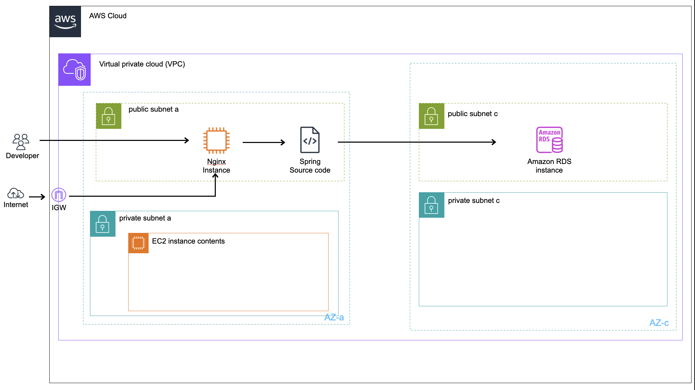
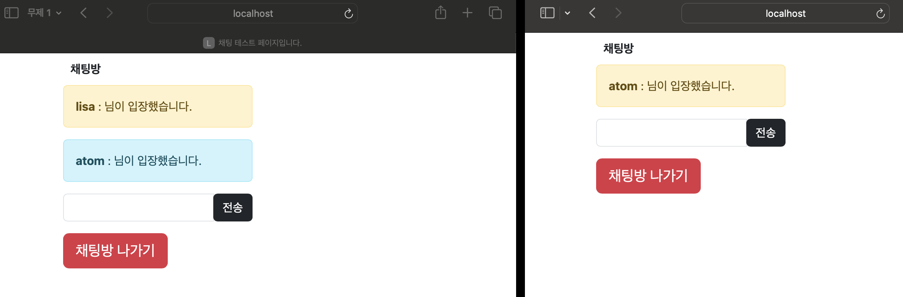
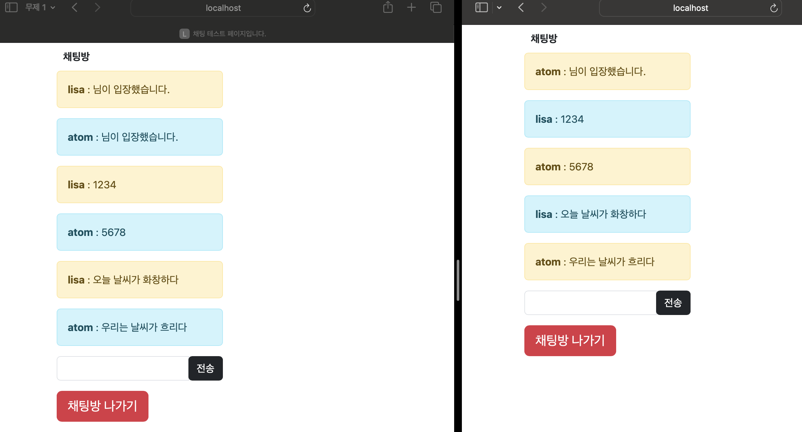
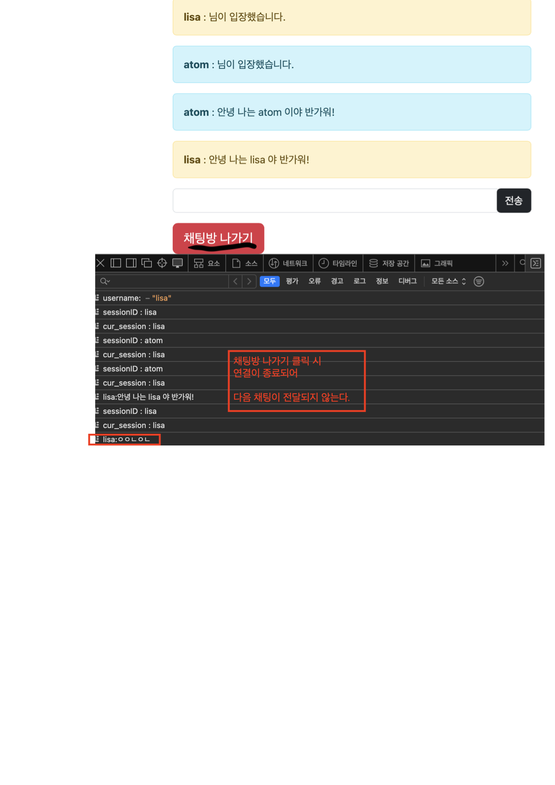
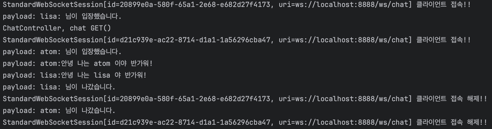
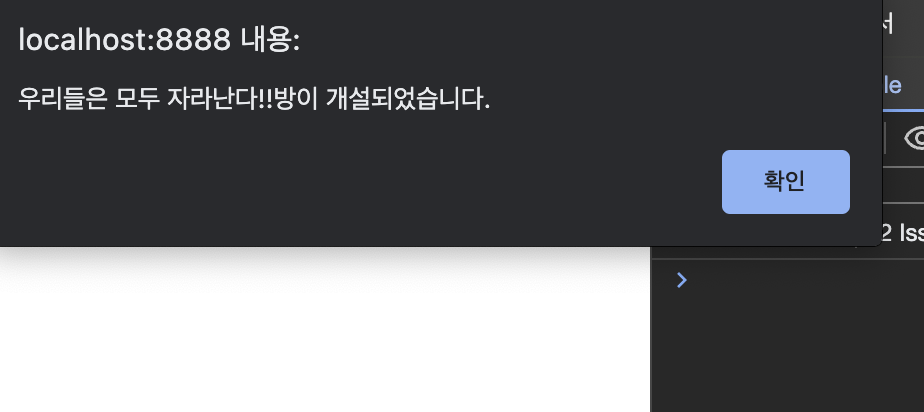
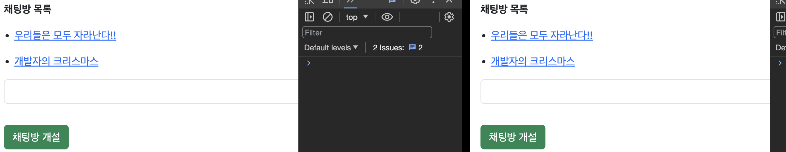
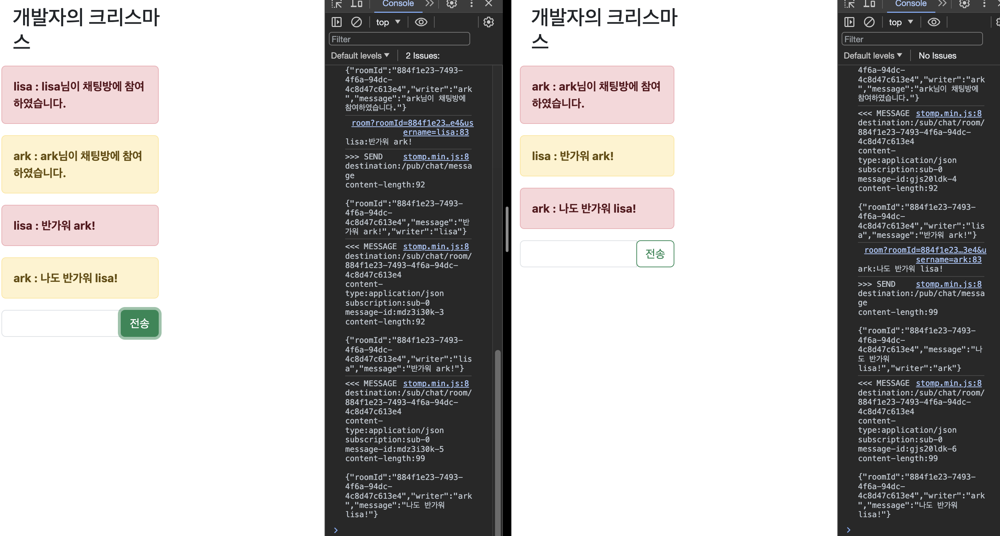
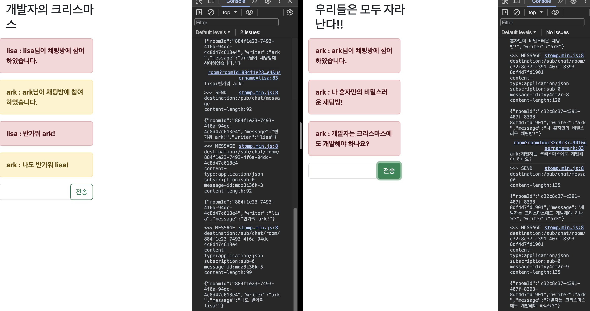

# Status: implemented

iOS 클라이언트와 Spring 서버 구조로 채팅 서비스를 개발하고 있습니다.

---

## 🖥️ Client Tech Stack

## 📔 Back Tech Stack

---

## 이 프로그램에서 사용되는 AWS 인프라 구조

---

## WekSocket 브라우저 통신 (Safari, Chrome 확인)

---

---

---

> Spring WebSocket을 이용해 텍스트 메시지를 실시간으로 주고 받을 수 있습니다.

---

## STOMP 브라우저 통신 (Safari, Chrome, Edge 확인)

---

---

---

> Spring STOMP를 이용해 텍스트 메시지를 실시간에(스트리밍형) 가깝게 주고 받을 수 있다.

---